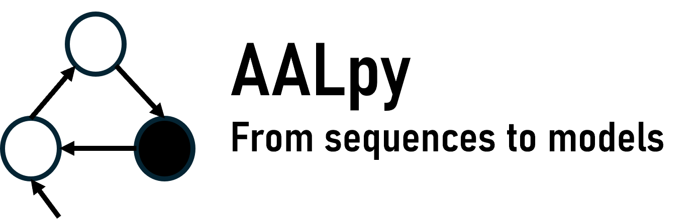

<div align="center">

<picture style="align: center; padding-bottom: 3mm;">
  <source media="(prefers-color-scheme: dark)" srcset="./docs/logo_dark.png">
  
</picture>

<br/>
<br/>

[](https://github.com/DES-Lab/AALpy/actions/workflows/python-app.yml)
[](https://github.com/DES-Lab/AALpy/actions/workflows/codeql-analysis.yml)


[](https://github.com/DES-Lab/AALpy/issues)

[](https://www.python.org/downloads/release/python-360/)

[](https://GitHub.com/Naereen/StrapDown.js/graphs/commit-activity)
[](https://opensource.org/licenses/MIT)

</div>
<hr />

AALpy is a light-weight [automata learning](https://medium.com/p/82f7ec21d50d) library written in Python. 
You can start learning models of black-box systems with a few lines of code.

<!---
AALpy supports both **active** and **passive** automata learning algorithms that can be used to learn a variety of modeling formalisms, including 
**deterministic**, **non-deterministic**, and **stochastic automata**, as well as **deterministic context-free grammars/pushdown automata**.

AALpy also features a Generalized State Merging (GSM) framework based on the [Red-Blue method](https://www.researchgate.net/publication/221523449_Results_of_the_Abbadingo_One_DFA_Learning_Competition_and_a_New_Evidence-Driven_State_Merging_Algorithm), which simplifies the implementation of more complex and extensible passive learning algorithms, such as EDSM, k-tails and likelihood-ratio.
-->

<div align="center">
   
| **Automata Type** |                      **Supported Formalisms**                     | **Active Algorithms**                                          |              **Passive Algorithms**                       |
|-------------------|:-----------------------------------------------------------------:|---------------------------------------------------------|------------------------------------|
| Deterministic     |                 DFAs <br /> Mealy Machines <br /> Moore Machines                 | L* <br /> KV <br />  L#           |        RPNI <br /> EDSM <br /> GSM      |
| Non-Deterministic |                      ONFSM <br /> Non-deterministic Moore Machines <br /> Abstracted ONFSM                      | L*<sub>ONFSM</sub>                                |  k-tails    |  
| Stochastic        | Markov Decision Processes <br /> Stochastic Mealy Machines <br /> Markov Chains | L*<sub>MDP</sub> <br /> L*<sub>SMM</sub> | Alergia <br /> IoAlergia <br /> Alergia<sub>EDSM</sub> |    
| Pushdown          |          VPA/SEVPA                                                            | KV<sub>VPA</sub>                  |    PAPNI      |    
</div>

## Installation

Use the package manager [pip](https://pip.pypa.io/en/stable/) to install the latest release of AALpy:
```bash
pip install aalpy
```
To install current version of the master branch (it might contain bugfixes and added functionalities between releases):
```bash
pip install https://github.com/DES-Lab/AALpy/archive/master.zip
```
The minimum required version of Python is 3.6.  
Ensure that you have [Graphviz](https://graphviz.org/) installed and added to your path if you want to visualize models.

For manual installation, clone the repo and install `pydot` (the only dependency).

## Documentation and Wiki

High level introduction to automata learning can be found at the following [Medium post](https://medium.com/p/82f7ec21d50d).
If you are interested in automata learning or would like to understand the automata learning process in more detail,
please check out our **Wiki**. On Wiki, you will find more detailed examples on how to use AALpy.
- <https://github.com/DES-Lab/AALpy/wiki>

***[Examples.py](https://github.com/DES-Lab/AALpy/blob/master/Examples.py)*** contains examples covering almost the whole of AALpy's functionality and its a great starting point. 

### Usage

All active automata learning procedures follow this high-level approach:
- [Define the input alphabet and system under learning (SUL)](https://github.com/DES-Lab/AALpy/wiki/SUL-Interface,-or-How-to-Learn-Your-Systems)
- [Choose the equivalence oracle](https://github.com/DES-Lab/AALpy/wiki/Equivalence-Oracles)
- [Run the learning algorithm](https://github.com/DES-Lab/AALpy/wiki/Setting-Up-Learning)

Passive learning algorithm simply require you to provide data in the appropriate format (check Wiki and Examples) and run the learning function.


<details>
  <summary>Code snipped demonstrating some of AALpy's functionalities</summary>

The following snippet demonstrates a short example in which an automaton is either [loaded](https://github.com/DES-Lab/AALpy/wiki/Loading,Saving,-Syntax-and-Visualization-of-Automata) or [randomly generated](https://github.com/DES-Lab/AALpy/wiki/Generation-of-Random-Automata) and then [learned](https://github.com/DES-Lab/AALpy/wiki/Setting-Up-Learning).
```python
from aalpy.utils import load_automaton_from_file, generate_random_deterministic_automata
from aalpy.SULs import AutomatonSUL
from aalpy.oracles import RandomWalkEqOracle
from aalpy.learning_algs import run_Lstar, run_KV

# load an automaton
# automaton = load_automaton_from_file('path_to_the_file.dot', automaton_type='dfa')

# or randomly generate one
random_dfa = generate_random_deterministic_automata(automaton_type='dfa', num_states=8, 
                                                    input_alphabet_size=5, output_alphabet_size=2)

# get input alphabet of the automaton
alphabet = random_dfa.get_input_alphabet()

# loaded or randomly generated automata are considered as BLACK-BOX that is queried
# learning algorithm has no knowledge about its structure
# create a SUL instance for the automaton/system under learning
sul = AutomatonSUL(random_dfa)

# define the equivalence oracle
eq_oracle = RandomWalkEqOracle(alphabet, sul, num_steps=5000, reset_prob=0.09)

# start learning
# run_KV is for the most part reacquires much fewer interactions with the system under learning
learned_dfa = run_KV(alphabet, sul, eq_oracle, automaton_type='dfa')
# or run L*
# learned_dfa_lstar = run_Lstar(alphabet, sul, eq_oracle, automaton_type='dfa')

# save automaton to file and visualize it
# save_automaton_to_file(learned_dfa, path='Learned_Automaton', file_type='dot')
# or
learned_dfa.save()

# visualize automaton
# visualize_automaton(learned_dfa)
learned_dfa.visualize()
# or just print its DOT representation
print(learned_dfa)
```
</details>

To make experiments reproducible, define a random seed at the beginning of your program.
```Python
from random import seed
seed(2) # all experiments will be reproducible
```

## Selected Applications
AALpy has been used to:
- [Learn Models of Bluetooth Low-Energy](https://github.com/apferscher/ble-learning)
- [Find bugs in VIM text editor](https://github.com/DES-Lab/AALpy/discussions/13)
- [Learn Input-Output Behavior of RNNs](https://github.com/DES-Lab/Extracting-FSM-From-RNNs)
- [Learn Models of GIT](https://github.com/taburg/git-learning)
- [Solve RL Problems](https://github.com/DES-Lab/Learning-Environment-Models-with-Continuous-Stochastic-Dynamics)

## Cite AALpy and Research Contact
If you use AALpy in your research, please cite us with of the following:
- [Extended version (preferred)](https://www.researchgate.net/publication/359517046_AALpy_an_active_automata_learning_library/citation/download)
- [Tool paper](https://dblp.org/rec/conf/atva/MuskardinAPPT21.html?view=bibtex)

If you have research suggestions or you need specific help concerning your research, feel free to start a [discussion](https://github.com/DES-Lab/AALpy/discussions) or contact [edi.muskardin@silicon-austria.com](mailto:edi.muskardin@silicon-austria.com).
We are happy to help you and consult you in applying automata learning in various domains.

## Contributing
Pull requests are welcome. For significant changes, please open an issue first to discuss what you would like to change.
In case of any questions or possible bugs, please open issues.
